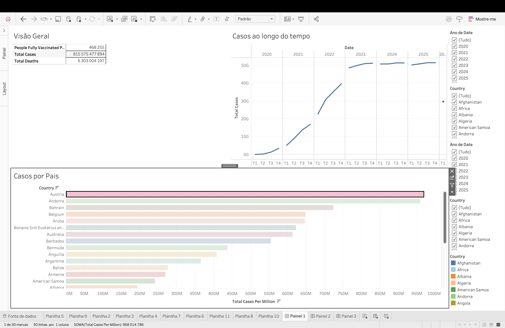
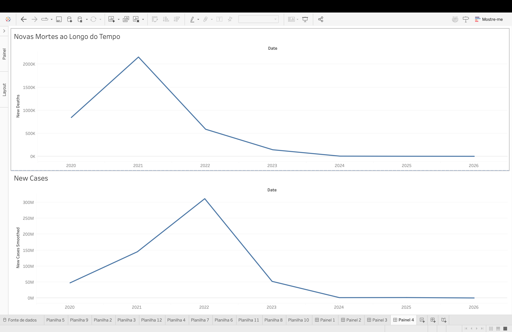
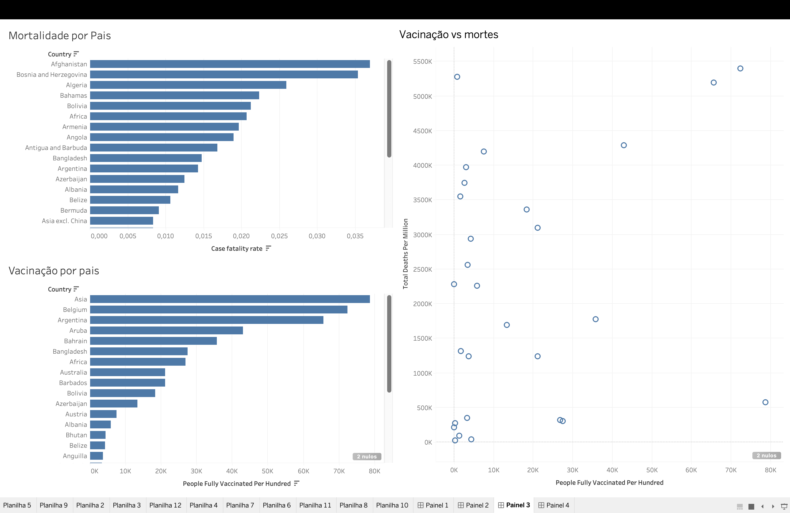

# SVDC_TEST
# Análise de Dados COVID-19 

O objetivo deste projeto é analisar a evolução da pandemia de COVID-19 através de um conjunto de dados real, identificando padrões temporais e geográficos, bem como o impacto de fatores como vacinação, testes e capacidade dos sistemas de saúde.

Pretende-se comunicar insights relevantes que possam apoiar a tomada de decisão em contextos de saúde pública.

---

## 🧹 Pré-processamento e Transformação de Dados

Durante a fase de análise exploratória, foram realizadas as seguintes etapas de limpeza e transformação:

### 1. Tratamento de valores nulos

* O ficheiro foi convertido em .xls dado a um erro no tableau quando usei a fonte csv.
* Foram identificadas colunas com valores em falta (null).
* Colunas completamente vazias foram removidas. (Human development index, Weekly icu admissions, Weekly icu admissions per mil)

---

### 2. Filtragem de dados inconsistentes

* Gostaria de ter aplicado filtros para lidar com dados com valores inválidos mas dado o tempo nao o consegui fazer mas da minha avaliação do dataset não me pareceram existir(ex: valores negativos em casos ou mortes).

---

### 3. Criação de métricas derivadas

Foram criadas novas variáveis para permitir uma análise mais aprofundada:

* **Taxa de Mortalidade (Case Fatality Rate)**
  `total_deaths / total_cases`

* **Crescimento de Casos (Growth Rate)**
  `new_cases / valor anterior`

* **Taxa de Vacinação**
  `people_fully_vaccinated / population`

---

## Objetivos da Visualização

As visualizações foram organizadas em dashboards com objetivos específicos, permitindo uma análise estruturada da pandemia.

---

### 1. Executive Summary

**Objetivo:**
Fornecer uma visão geral do estado da pandemia.

**Perguntas:**

* Qual a dimensão global da pandemia?
* Como evoluiu ao longo do tempo?
* Que países foram mais afetados?

**Visualizações:**

* KPIs (casos totais, mortes, vacinação)
* Evolução temporal dos casos
* Mapa global

---

### 2. Evolução Temporal

**Objetivo:**
Analisar o comportamento da pandemia ao longo do tempo.

**Perguntas:**

* Existem padrões ou ondas?
* Quando ocorreram picos de infeção?

**Visualizações:**

* Novos casos ao longo do tempo
* Novas mortes

---

### 3. Comparação entre Países e Vacinação e Impacto

**Objetivo:**
Identificar diferenças entre países e fatores explicativos.
Avaliar o efeito da vacinação na evolução da pandemia.

**Perguntas:**

* Que países foram mais afetados (relativamente)?
* Existem diferenças na mortalidade?
* O impacto foi uniforme?

* A vacinação contribuiu para reduzir mortes?
* Existe relação entre vacinação e impacto?

**Visualizações:**

* Casos por milhão
* Mortes por milhão
* Taxa de mortalidade

* Evolução da vacinação
* Scatter plot: vacinação vs mortes
* Comparação temporal antes/depois vacinação

---

